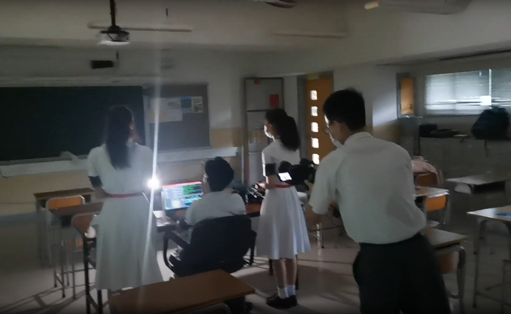
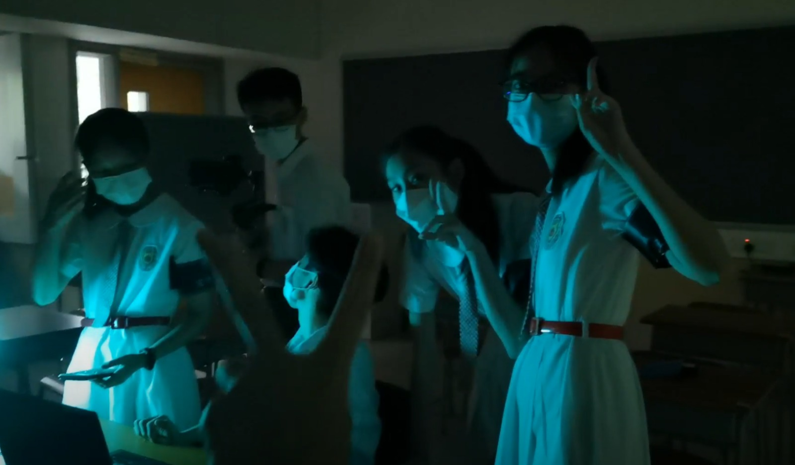
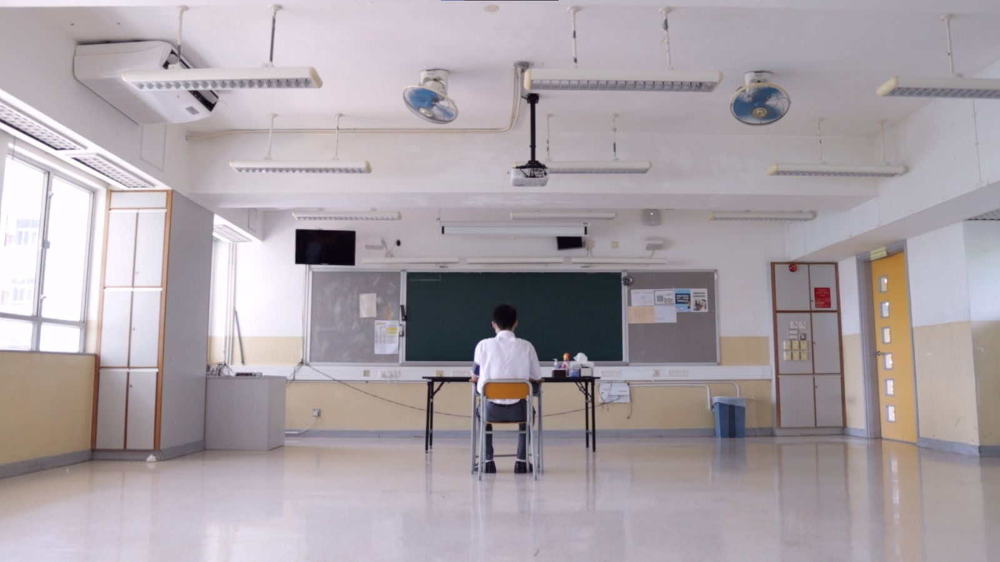
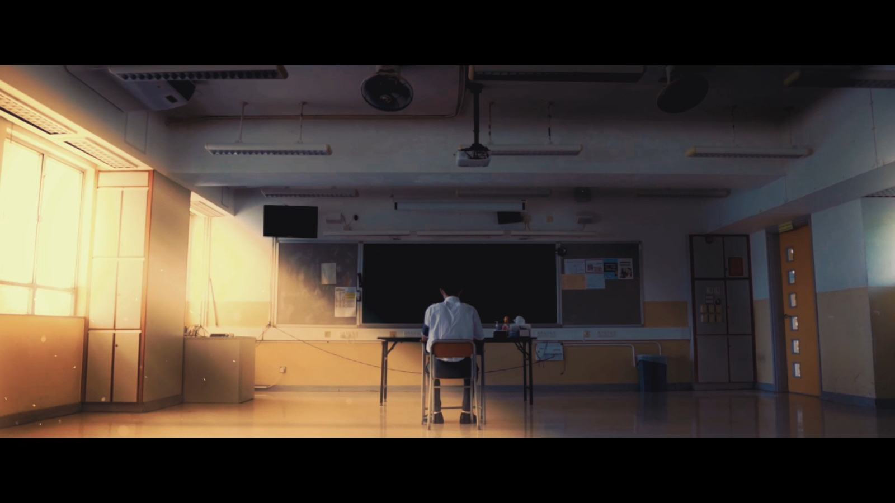
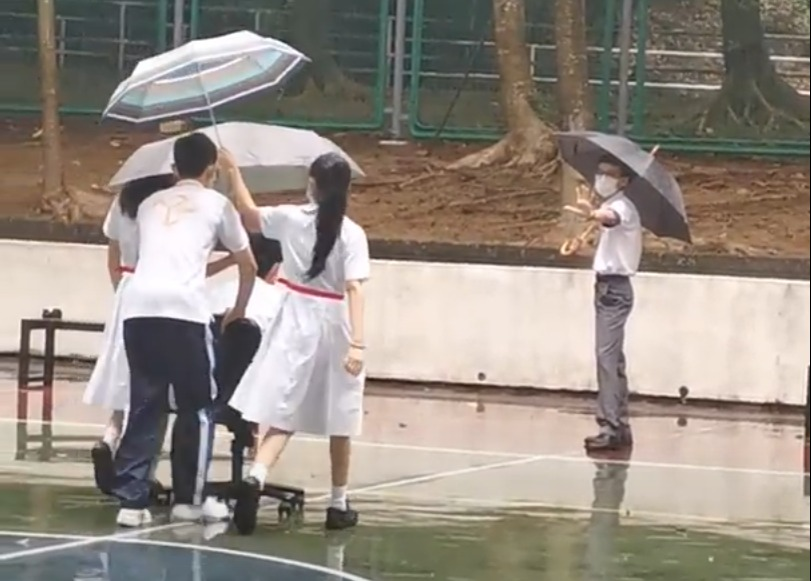

:::tip 理念宣傳片心得-主席
Hello大家好！我係主席顏維Tommy~ 

琴日,我哋製作咗一個月嘅理念宣傳片正式開播！作為條宣傳片嘅總製作人,我非常感謝同學們支持嘅話語,亦希望大家都鍾意條片

先講下條片嘅解析。喺疫情嘅重重陰霾底下,好多活動同服務都唔可以面對面進行,令同學嘅校園生活失去咗光澤。片中有大約20秒以直觀嘅調色以及天氣描述以上嘅狀況。接下來就到Siri出場,中間一段宣傳部及技術嘅片段,寓意本閣會以科技去打破疫情嘅籠罩,以科技連接學校同每一位學生,為大家帶嚟唔受疫情影響而創新嘅活動同服務。當一切就緒,Siri就會帶來精彩、卓越、無限,並且為無色嘅校園帶來繽紛。前半部分帶出一種陰沉嘅感覺,而後半部分就顯得燦爛、活潑,以此作對比。

呢條片由8月16號開始取景,24-27號正式拍攝,到上星期完工。我哋都一直堅守住一個信義,就係要為大家帶嚟最震撼、史無前例嘅觀感。我希望我哋嘅信念有充分地傳達到畀同學,亦希望同學可以了解到我閣嘅理念。技術方面,本片使用軟件DaVinci Resolve 16作調色與剪輯、Adobe After Effects作特效合成,所有特效都由我哋原創製作。拍攝器材為Canon EOS M50 + Sigma 16mm f1.4 + Zhiyun weebill lab。全片用1080p 60fps拍攝,1080p 24fps輸出。放少少幕後圖片畀大家睇: 

呢張特別講一下,我哋專登揀喺落雨天返學校拍攝,目的就係為咗拍攝最佳嘅鏡頭,不懼風雨、勇往直前、同心合力咁完成該片段。
:::